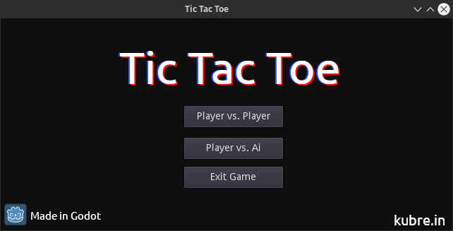
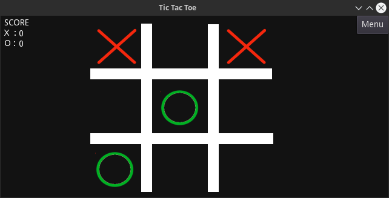

# Tic Tac Toe in Godot

## Intro
Entire Tic Tac Toe game example in godot 3.1 or up.
All the Assests in XCF(GIMP format) and png format are provided inside assets directory.

### Main Menu Screen

### Game Play

## Roadmap
 
- [x] Player vs Player Mode
- [x] Manage Score
- [x] Start Screen
- [ ] Player vs Ai Mode

## License and Copyrights
Feel free to copy or redistribute as you wish no credit required (Both game and assets). (entirely optional but great if you can give link to my website https://kurbe.in). Open issue if you want to see new feature implemented or found a Bug.

## Misc

- Find out more about my learning experience while coding this game on my youtube channel : [kubre](https://www.youtube.com/channel/UCruYKNvpEEMN-gtGRu98W_g)

- Download Godot Game Engine: [Godot Downloads](https://godotengine.org/download)

## Akownledgements
Project is inspired by Bit Bionic from his youtube tutorial here's link to his repo:
[Tic Tac Toe in Godot 3](https://github.com/bitbionic/tic-tac-toe-gd3)

